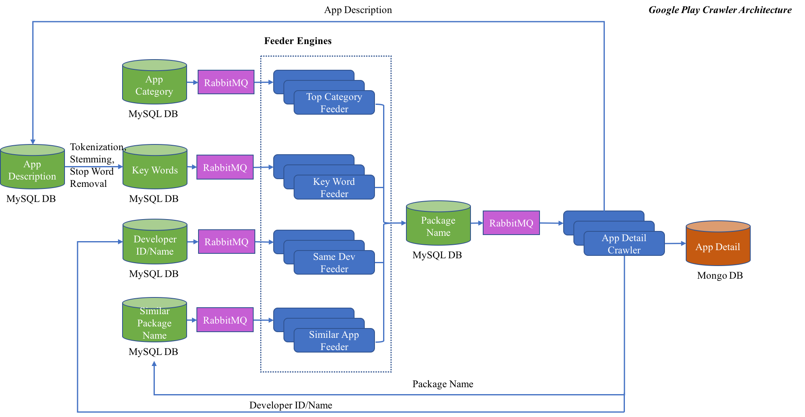
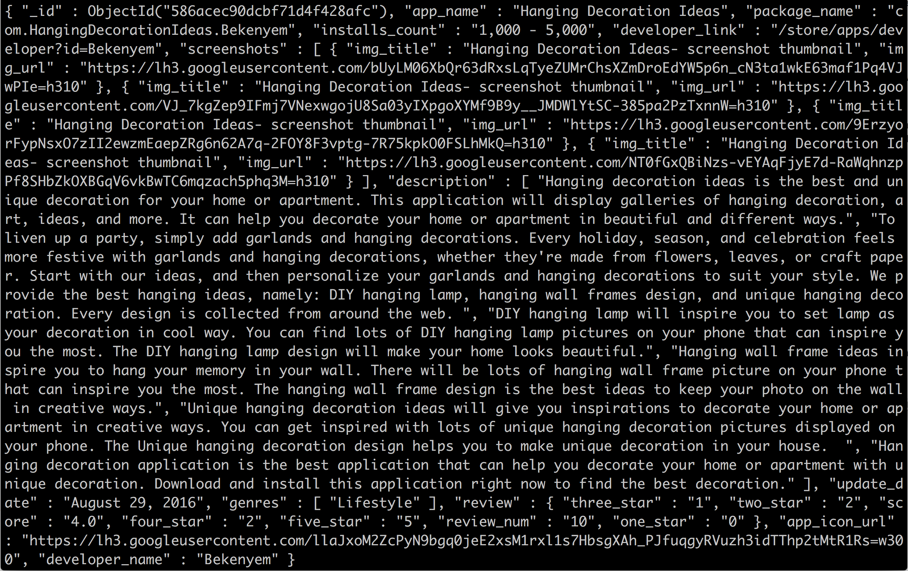

# Google Play Crawler
Google Play Crawler is able to automatically and efficiently crawl the detail information of Android apps on Google Play.

# Architecture

The architecture of this project is depicted in the following figure.


Key points of this project are detailed below:

## Feeder

Every Android app on the [Google Play](https://play.google.com/store/apps) has a separate URL link, and this link is constructed in the format *https://play.google.com/store/apps/details?id=\<package_name\>*. For example, the package name of [Chrome Browser](https://play.google.com/store/apps/details?id=com.android.chrome) is *com.android.chrome*, hence, the URL to access the detail of this app is *https://play.google.com/store/apps/details?id=com.android.chrome*.Therefore, to crawl app detail information from Google Play, we need some feeders to produce package names. In this project, four different kinds of feeder engines are used to generate package names which are finally stored in a center database.

* Top Category Feeder

	Apps on Google Play fall into different categories (or genres), and for each category, there are some top apps recommended by Google Play. *Top Category Feeder* targets crawling app package names under each top category.
	
* Key Word Feeder
	
	Google Play provides the ability to search apps via key word. In this project, key words are generated through performing tokenization, stemming and stop word removal on the raw text. The raw text is collected from the description of each app crawled from Google Play.
	
* Same Developer Feeder

	An Android app developer may own many apps at the same time. Apps developed by the same developer can be accessed via the URL in this format *https://play.google.com/store/apps/dev?id=<dev_id>* or *https://play.google.com/store/apps/developer?id=<dev_id>*. For example, apps developed by Google Inc. can be viewed at this URL *https://play.google.com/store/apps/dev?id=5700313618786177705*. This project extracts and stores the developer id and then automatically constructs and accesses the above URL to extract more app package names.
	
* Similar App Feeder

	When visiting the detail page of every Android app, users are recommended some similar apps at the right side. This project also extracts package names for these similar apps and then stores into database.
	
## Web Crawler

The whole project is developed based on [Selenium](http://www.seleniumhq.org/) and [Requests](http://docs.python-requests.org/en/master/) to automatically access the Google Play. Selenium is used to load a web browser to allow JavaScript execution as well as simulating some behaviors including page scrolling, button click and so on. Python HTTP library *Requests* is used to get web page content without any interaction.

## RabbitMQ

Google Play Crawler is developed using Producer-Consumer model based on [RabbitMQ](https://www.rabbitmq.com/). Each producer and consumer is running in a separate process, which makes it efficient to crawl web content.

## Data Storage
This project uses both MySQL and MongoDB to as storages. MySQL is mainly used to store information needed by each feeder engine, and MongoDB is used to store the detail information of each crawled app. The above architecture figure has depicted each database usage.

Each record in the MongoDB is showed in the following figure.



# Dependencies

* [Selenium](http://www.seleniumhq.org/)
* [RabbitMQ](https://www.rabbitmq.com/)
* [Requests](http://docs.python-requests.org/en/master/)
* [MySQL](https://www.mysql.com/)
* [MongoDB](https://www.mongodb.com/)
* [NLTK](http://www.nltk.org/)

# License

Copyright 2017 Shuang Ma & Wenjun Hu

Licensed under the Apache License, Version 2.0 (the "License");
you may not use this file except in compliance with the License.
You may obtain a copy of the License at

   http://www.apache.org/licenses/LICENSE-2.0

Unless required by applicable law or agreed to in writing, software
distributed under the License is distributed on an "AS IS" BASIS,
WITHOUT WARRANTIES OR CONDITIONS OF ANY KIND, either express or implied.
See the License for the specific language governing permissions and
limitations under the License.
